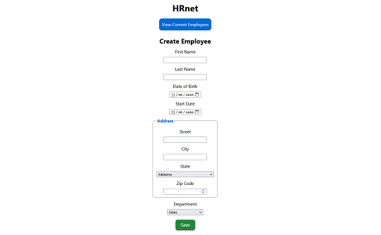
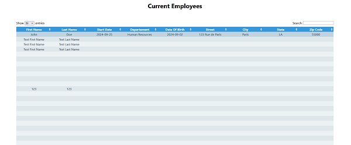

# HRnet Front-End

## Description

HRnet is a company's internal application to create and view employee records.

The aim of the project was to port the application form jQuery to React. Converting jQuery libraries into React components. Additionally, the goal was to create and publish an npm package and use it within the app.

## Installation

```bash
  git clone https://github.com/Yacine-Di/WealthHealth-Front.git
```

### `npm run dev`

Runs the app in the development mode.\
Open [http://localhost:3000](http://localhost:5173) to view it in your browser.

The page will reload when you make changes.\
You may also see any lint errors in the console.

## Stack

-   React
-   React Context and Provider
-   SCSS
-   NPM

## Lessons Learned

During this project, I learned how to create a reusable component and publish an npm package. Additionally, I learned how to write a well-structured README file for other users.

## Screenshots

Create Employee page <br>


Employees page <br>


## Authors

[Yacine D](https://github.com/Yacine-Di)
